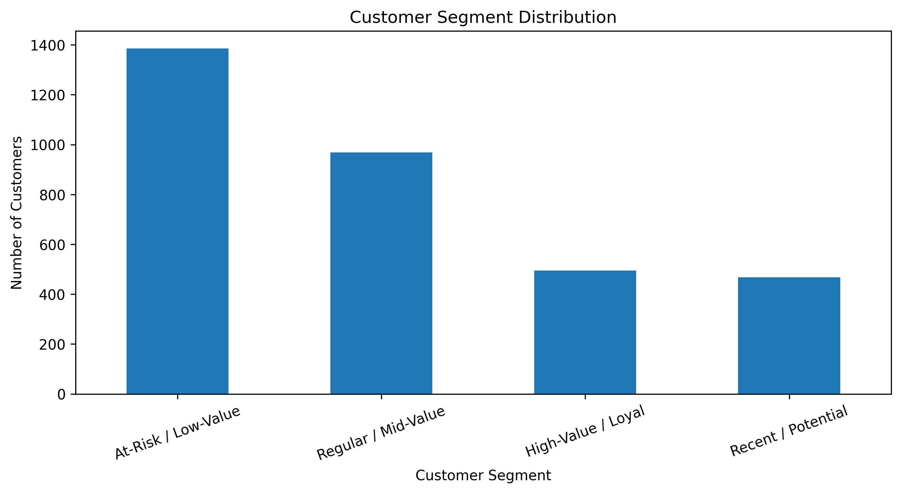
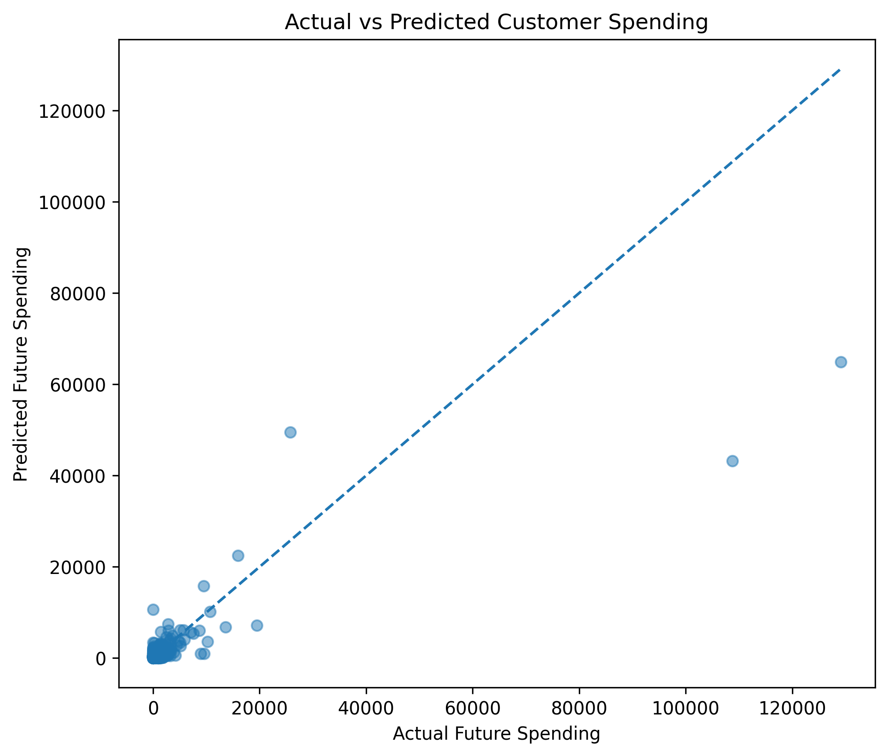

# Customer Lifetime Value Prediction & Segmentation

A machine learning project for analyzing customer purchasing behavior, segmenting customers using **RFM analysis and K-Means clustering**, and predicting future customer spending using regression models.

> In this project, future spending over the holdout period is used as a practical proxy for customer value.

---

## Project Overview

The objective of this project is to transform retail transaction data into actionable customer insights.

The workflow includes:

- Data cleaning and preprocessing
- RFM-based customer feature engineering
- Customer segmentation using K-Means clustering
- Future spending prediction
- Comparison of Linear Regression and Random Forest
- Customer-level business recommendations

---

## Dataset

The project uses the **UCI Online Retail Dataset**, containing transactions from a UK-based online retailer.

### Dataset Statistics

- **Raw Transactions:** 541,909
- **Cleaned Transactions:** 397,884
- **Customers Analyzed:** 3,317
- **Original Features:** 8

The dataset is stored at:

```text
data/Online Retail.xlsx
```

---

## Data Preprocessing

The following preprocessing steps were performed:

- Removed transactions with missing `CustomerID`
- Removed cancelled invoices
- Removed transactions with non-positive quantity
- Removed transactions with non-positive unit price
- Converted `CustomerID` to integer
- Created transaction value using:

```text
TotalPrice = Quantity × UnitPrice
```

The cleaned data contained **397,884 valid transactions**.

---

## Historical and Future Split

To avoid using future customer behavior while creating historical features, the dataset was divided chronologically.

### Historical Period

Transactions before:

```text
September 1, 2011
```

Historical transactions:

```text
226,467
```

### Future Period

Transactions from September 1, 2011 onwards.

Future transactions:

```text
171,417
```

Historical customer behavior was used to predict spending during the future period.

---

## Feature Engineering

Customer-level behavioral features were generated from historical transactions.

### RFM Features

- **Recency** — Number of days since the customer's latest purchase
- **Frequency** — Number of unique orders
- **Monetary** — Total historical spending

### Additional Features

- **Average Order Value**
- **Total Quantity Purchased**
- **Unique Products Purchased**

RFM features were log-transformed and standardized before clustering.

---

## Customer Segmentation

Customer segmentation was performed using **K-Means clustering**.

Silhouette scores were evaluated for multiple values of K. Although K=2 produced the highest silhouette score, **K=4** was selected to obtain more granular and actionable customer groups.

### Final Customer Segments

| Segment | Customers | Avg Historical Spend | Avg Frequency | Avg Recency |
|---|---:|---:|---:|---:|
| High-Value / Loyal | 495 | 6492.83 | 11.43 | 18.81 |
| Regular / Mid-Value | 968 | 1368.66 | 3.18 | 83.49 |
| Recent / Potential | 468 | 686.37 | 2.25 | 15.03 |
| At-Risk / Low-Value | 1386 | 273.59 | 1.17 | 150.41 |

### Segment Interpretation

**High-Value / Loyal**  
Customers with high spending, high purchase frequency, and recent activity.

**Regular / Mid-Value**  
Moderately active customers with consistent purchasing behavior.

**Recent / Potential**  
Customers who purchased recently but currently have lower purchase frequency.

**At-Risk / Low-Value**  
Customers with low spending and long periods since their latest purchase.

---

## Future Spending Prediction

The following features were used to predict future customer spending:

```text
Recency
Frequency
Monetary
AverageOrderValue
TotalQuantity
UniqueProducts
```

The customer-level dataset was divided into:

```text
80% Training Data
20% Testing Data
```

Two regression models were evaluated.

---

## Model Performance

### Linear Regression

| Metric | Result |
|---|---:|
| MAE | 813.51 |
| RMSE | 3866.81 |
| R² | 0.675 |

### Random Forest Regression

| Metric | Result |
|---|---:|
| MAE | 949.24 |
| RMSE | 4934.32 |
| R² | 0.470 |

**Linear Regression achieved the better test-set performance**, explaining approximately **67.5% of the variation in future customer spending**.

---

## Feature Analysis

Standardized Linear Regression coefficients were analyzed to understand the relative relationships between customer features and predicted future spending.

Historical **Monetary value** showed the strongest relationship with future spending.

Other influential features included:

- Average Order Value
- Total Quantity
- Unique Products
- Frequency
- Recency

The coefficients are interpreted as predictive relationships rather than causal effects.

---

## Business Insights

The customer segments can support different marketing and retention strategies:

| Customer Segment | Suggested Strategy |
|---|---|
| High-Value / Loyal | Loyalty programs and retention campaigns |
| Regular / Mid-Value | Cross-selling and upselling |
| Recent / Potential | Encourage repeat purchases |
| At-Risk / Low-Value | Re-engagement campaigns and targeted offers |

The **High-Value / Loyal** segment had the highest average historical and future spending, making customer retention particularly important for this group.

---

## Visualizations

### Customer Segment Distribution



### Actual vs Predicted Future Spending



---

## Technologies Used

- Python
- Pandas
- NumPy
- Matplotlib
- Scikit-learn
- K-Means Clustering
- StandardScaler
- Linear Regression
- Random Forest Regression

---

## Repository Structure

```text
Customer_Lifetime_Value_Prediction/
│
├── README.md
├── clv_analysis.py
├── .gitignore
│
├── data/
│   └── Online Retail.xlsx
│
└── outputs/
    ├── customer_segments.csv
    ├── predictions.csv
    ├── model_comparison.csv
    ├── business_summary.csv
    ├── customer_segments.png
    └── actual_vs_predicted.png
```

---

## Output Files

### `customer_segments.csv`

Contains customer-level RFM features and assigned customer segments.

### `predictions.csv`

Contains actual and predicted future customer spending for the test set.

### `model_comparison.csv`

Contains evaluation metrics for Linear Regression and Random Forest.

### `business_summary.csv`

Contains aggregated statistics for each customer segment.

### `customer_segments.png`

Visualization of customer segment distribution.

### `actual_vs_predicted.png`

Comparison between actual and predicted future customer spending.

---

## Key Results

- Analyzed **397,884 cleaned retail transactions**
- Engineered customer-level RFM and behavioral features
- Segmented **3,317 customers into 4 actionable groups**
- Built and compared two regression models
- Achieved **R² = 0.675** using Linear Regression
- Identified historical monetary value as the strongest predictive feature
- Generated customer-specific business strategies based on purchasing behavior

---

## Conclusion

This project demonstrates an end-to-end customer analytics and machine learning workflow combining **data preprocessing, feature engineering, unsupervised learning, supervised learning, model evaluation, visualization, and business interpretation**.

K-Means clustering produced four interpretable customer segments, while Linear Regression outperformed the tested Random Forest model for future-spending prediction with an **R² of 0.675**.
